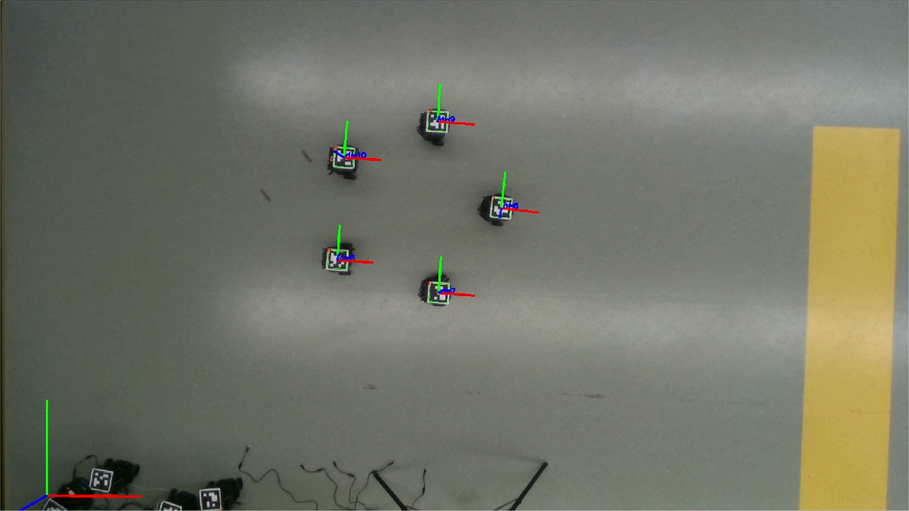
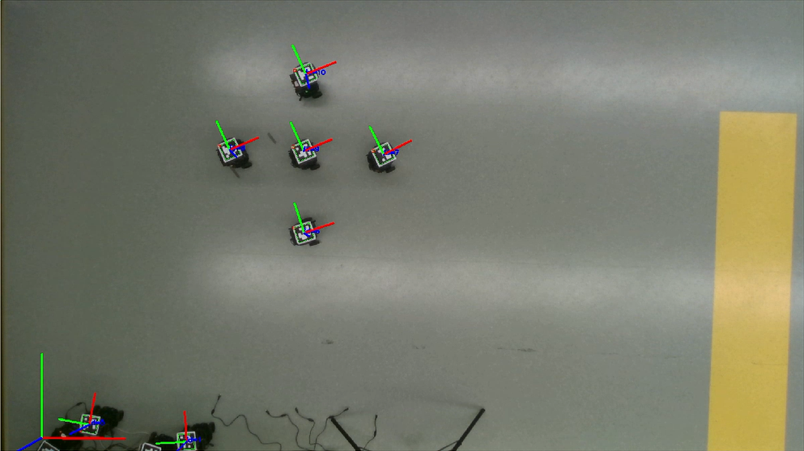

# 编队控制

## 实验目的和要求

### 基本任务

初始位姿任意，自行选择复杂队形（例如：圆形、星形、楔形……）完成队形的构建以及变换。

### 附加任务

1. 能同时控制角速度和速度，而不是先转再走的分离控制
2. 实现编队在任意位置时都能无碰撞地形成编队
3. 根据当前位置自主选择编队形状
4. 动态分配各小车在编队中的位置，而非指定小车在编队中固定位置

## 算法设计思路

为了防止碰撞，本次实验基本采用课上给出的权重函数，按其负梯度方向给出控制器， x, y 方向分别进行独立控制。

本次实验同时设计了角色分配和队形选择的方法，通过遍历计算每种可能情况和当前状态的偏差值实现。取当前偏差最小的队形及角色分配作为控制目标

由于无法直接控制机器人的 x, y 方向的速度，小组设计了一个同时控制角速度和前进速度的方法来模拟 x, y 方向的直接控制，虽然不能做到完全一样，但实验证明这个方法也能向目标队形靠近，并最终收敛。

最终在机器人队形收敛完成后，进行角度一致性协议让机器人朝向同一方向，之后控制结束。

## 实验效果

本次实验取得了良好的结果，由于视频太大，此处仅进行截图展示。

### 三种队形的形成






### 队形选择（十字变楔形）


### 角色分配（互换角色）


## 实验分析

机器人在角度接近达到一致时会反复进行微小转向，可能是视觉识别跳动导致的，因为识别不到时系统会将上一次的识别结果作为这一次的识别结果，导致控制结果和实际有微小偏差，再加上设置的收敛判定阈值较小，所以会造成在收敛状态附近进行微小振动。

由于速度控制是模拟的 x,y 方向控制，不能完全保持一致，当机器人离得过于接近时会出现碰撞，不过这个现象出现的概率很低。实验时将线速度限制在较低水平，角速度略微提高，以此提高模拟控制的符合程度，效果较好。

## 附录：实验代码

```c++
/* 
 * Date: 2021-12-08
 * Description: Formation control Distributed
 * Group：group 2
 */
#include <swarm_robot_control.h>
#include <cmath>
#include <algorithm>
#define pi 3.1415926

/***********add by group*********/
/* Velocity scale and threshold */
double k_w = 0.5;       // Scale of angle velocity
double k_v = 0.3;       // Scale of linear velocity
double k_zeta = 0.2;  // Scale of formation cost (estimation)
double k_xi = 0.05;    // Scale of formation cost
double MAX_W = 1;       // Maximum angle velocity (rad/s)
double MIN_W = 0.05;    // Minimum angle velocity(rad/s)
double MAX_V = 0.2;     // Maximum linear velocity(m/s)
double MIN_V = 0.01;    // Minimum linear velocity(m/s)
double Delta = 2.5;     // 通讯范围


/* PID-control pos */
void pos_control(SwarmRobot& swarm, int index, double x_error, double y_error, double yaw){
    double w = atan(y_error/x_error);
    double v = sqrt(x_error*x_error + y_error*y_error);
    if (x_error < 0){
        if (y_error > 0){
            w += pi;
        }
        else {
            w -= pi;
        }
    }
    w = w - yaw;
    v *= pow(cos(w), 3);
    v *= k_v;
    w *= k_w;
    v = swarm.checkVel(v, MAX_V, MIN_V);
    w = swarm.checkVel(w, MAX_W, MIN_W);
    swarm.moveRobot(index, v, w);
}

int main(int argc, char** argv) {

    /*ROS initial*/ 
    ros::init(argc, argv, "swarm_robot_control_formation");
    ros::NodeHandle nh;
    
    /* First: Set ids of swarm robot based on Aruco marker */
    std::vector<int> swarm_robot_id{1, 2, 3, 4, 5};

    /* Initialize swarm robot */
    SwarmRobot swarm_robot(&nh, swarm_robot_id);
    

    /* Set L Matrix */
    Eigen::MatrixXd lap(swarm_robot_id.size(), swarm_robot_id.size());
    Eigen::MatrixXd L_x(swarm_robot_id.size(), swarm_robot_id.size());
    Eigen::MatrixXd L_y(swarm_robot_id.size(), swarm_robot_id.size());
    lap <<  4, -1, -1, -1, -1,
            -1, 4, -1, -1, -1,
            -1, -1, 4, -1, -1,
            -1, -1, -1, 4, -1,
            -1, -1, -1, -1, 4;

    int target_formation[5] = {0};             // 目标编队序号
    double characteristic_length = 0.8;        // 编队特征长度
    int formation_num = 360;                   // 编队种类，0-119 为圆形 120-239 为星形 240-359 为楔形
    int array_flag[5] = {0, 1, 2, 3, 4};
    Eigen::MatrixXd circle(swarm_robot_id.size(), 2);            // 圆形编队相对位置 [x y]
    Eigen::MatrixXd star(swarm_robot_id.size(), 2);              // 星形编队相对位置
    Eigen::MatrixXd wedge(swarm_robot_id.size(), 2);             // 楔形编队相对位置
    Eigen::MatrixXd zeta(swarm_robot_id.size(), formation_num);  // 队形代价估计量
    Eigen::MatrixXd xi(swarm_robot_id.size(), formation_num);    // 队形代价真实量

    /* Formation information */
    for (int i = 0; i < 5; ++i){
        circle(i, 0) = characteristic_length*cos(i*2*pi/5);
        circle(i, 1) = characteristic_length*sin(i*2*pi/5);
    }
    star(0, 0) = star(0, 1) = 0;
    for (int i = 1; i < 5; ++i){
        star(i, 0) = characteristic_length*cos((i - 1)*pi/2);
        star(i, 1) = characteristic_length*sin((i - 1)*pi/2);
    }
    wedge(0, 0) = wedge(0, 1) = 0;
    wedge(1, 0) = characteristic_length*cos(-2*pi/3); wedge(1, 1) = characteristic_length*sin(-2*pi/3);
    wedge(2, 0) = characteristic_length*cos(-pi/3); wedge(2, 1) = characteristic_length*sin(-pi/3);
    wedge(3, 0) = 2*characteristic_length*cos(-2*pi/3); wedge(3, 1) = 2*characteristic_length*sin(-2*pi/3);
    wedge(4, 0) = 2*characteristic_length*cos(-pi/3); wedge(4, 1) = 2*characteristic_length*sin(-pi/3);

    // 队形相对位置，120种角色分配×3种队形
    Eigen::MatrixXd Formation_x(swarm_robot_id.size(), formation_num);
    Eigen::MatrixXd Formation_y(swarm_robot_id.size(), formation_num);
    for (int i = 0; i < 120; ++i){
        for (int j = 0; j < 5; ++j){
            Formation_x(j, i) = circle(array_flag[j], 0) - circle(array_flag[0], 0);
            Formation_y(j, i) = circle(array_flag[j], 1) - circle(array_flag[0], 1);
            Formation_x(j, i + 120) = star(array_flag[j], 0) - star(array_flag[0], 0);
            Formation_y(j, i + 120) = star(array_flag[j], 1) - star(array_flag[0], 1);
            Formation_x(j, i + 240) = wedge(array_flag[j], 0) - wedge(array_flag[0], 0);
            Formation_y(j, i + 240) = wedge(array_flag[j], 1) - wedge(array_flag[0], 1);
        }
        std::next_permutation(array_flag,array_flag + 5);
    }

    /* Convergence threshold */
    double conv_th = 0.1;  // Threshold of angle, in rad
    double conv_pos = 0.05;  // Threshold of pos
    double conv_formation = 0.1;  // Threshold of formation cost

    /* Mobile robot poses and for next poses */
    Eigen::VectorXd cur_x(swarm_robot_id.size());
    Eigen::VectorXd pic_x(swarm_robot_id.size());    // pic_x = cur_x - formation_x
    Eigen::VectorXd cur_y(swarm_robot_id.size());
    Eigen::VectorXd pic_y(swarm_robot_id.size());    // pic_y = cur_y - formation_y
    Eigen::VectorXd cur_theta(swarm_robot_id.size());
    Eigen::VectorXd del_x(swarm_robot_id.size());
    Eigen::VectorXd del_y(swarm_robot_id.size());
    Eigen::VectorXd del_theta(swarm_robot_id.size());
    Eigen::VectorXd del_formation(swarm_robot_id.size());

    /* Get swarm robot poses firstly */
    std::vector<std::vector<double> > current_robot_pose(swarm_robot_id.size());
    
    swarm_robot.getRobotPose(current_robot_pose);

    for(int i = 0; i < swarm_robot_id.size(); i++) {
        cur_x(i) = current_robot_pose[i][0];
        cur_y(i) = current_robot_pose[i][1];
        cur_theta(i) = current_robot_pose[i][2];
    }

    /* Convergence sign */
    bool angle_conv = false;   // Convergence sign of angle
    bool pos_conv = false;     // Convergence sign of position

    /* Init xi 初始化各队形代价估计量 */
    for (int i = 0; i < formation_num; ++i){
        for (int j = 0; j < swarm_robot_id.size(); ++j){
            double tmp = 0;
            for (int k = 0; k < swarm_robot_id.size(); ++k){
                if (k == j){
                    continue;
                }
                tmp += sqrt(pow(cur_x(j) - cur_x(k) - Formation_x(j, i) + Formation_x(k, i), 2) + pow(cur_y(j) - cur_y(k) - Formation_y(j, i) + Formation_y(k, i), 2));
            }
            xi(j, i) = tmp;
        }
    }
    zeta = xi;

    /* 队形收敛 */
     while(! pos_conv) {
        /* 选择队形 & 角色分配 */
        for (int i = 0; i < swarm_robot_id.size(); ++i){
            double min_cost = 1e+9;
            for (int j = 0; j < formation_num; ++j){
                if (zeta(i, j) < min_cost){
                    target_formation[i] = j;
                    min_cost = zeta(i, j);
                }
            }
        }
        std::cout << "当前各机器人队形选择为： " << target_formation[0] << " " << target_formation[1] << " " << target_formation[2] << " " << target_formation[3] << " " << target_formation[4] << std::endl;

        for (int i = 0; i < formation_num; ++i){
            for (int j = 0; j < swarm_robot_id.size(); ++j){
                double tmp = 0;
                for (int k = 0; k < swarm_robot_id.size(); ++k){
                    if (k == j){
                        continue;
                    }
                    tmp += sqrt(pow(cur_x(j) - cur_x(k) - Formation_x(j, i) + Formation_x(k, i), 2) + pow(cur_y(j) - cur_y(k) - Formation_y(j, i) + Formation_y(k, i), 2));
                }
                xi(j, i) = tmp;
            }
        }
        
        for (int i = 0; i < swarm_robot_id.size(); ++i){
            pic_x(i) = cur_x(i) - Formation_x(i, target_formation[i]);
            pic_y(i) = cur_y(i) - Formation_y(i, target_formation[i]);
        }

        for (int i = 0; i < swarm_robot_id.size(); ++i){
            for (int j = 0; j < swarm_robot_id.size(); ++j){
                if (j == i){
                    continue;
                }
                L_x(i, j) = L_x(j, i) = -2*((Delta - std::fabs(Formation_x(i, target_formation[i]) - Formation_x(j, target_formation[j]))) - std::fabs(pic_x(i) - pic_x(j)))/\
                pow((Delta - std::fabs(Formation_x(i, target_formation[i]) - Formation_x(j, target_formation[j])) - std::fabs(pic_x(i) - pic_x(j))), 2);
            }
        }
        for (int i = 0; i < swarm_robot_id.size(); ++i){
            for (int j = 0; j < swarm_robot_id.size(); ++j){
                if (j == i){
                    continue;
                }
                L_y(i, j) = L_y(j, i) = -2*((Delta - std::fabs(Formation_y(i, target_formation[i]) - Formation_y(j, target_formation[j]))) - std::fabs(pic_y(i) - pic_y(j)))/\
                pow((Delta - std::fabs(Formation_y(i, target_formation[i]) - Formation_y(j, target_formation[j])) - std::fabs(pic_y(i) - pic_y(j))), 2);
            }
        }
        for (int i = 0; i < swarm_robot_id.size(); ++i){
            double tmp1 = 0;
            double tmp2 = 0;
            for (int j = 0; j < swarm_robot_id.size(); ++j){
                if (j == i){
                    continue;
                }
                tmp1 -= L_x(i, j);
                tmp2 -= L_y(i, j);
            }
            L_x(i, i) = tmp1;
            L_y(i, i) = tmp2;
        }

        /* Judge whether reached */
        del_x = -L_x * pic_x;
        del_y = -L_y * pic_y;
        del_theta = -lap * cur_theta;
        pos_conv = true;
        angle_conv = true;
        if(std::fabs(del_theta.norm()) > conv_th) {
            angle_conv = false;
        }
        if(std::fabs(del_x.norm()) > conv_pos && std::fabs(del_y.norm()) > conv_pos) {
            pos_conv = false;
        }

        /* Swarm robot move */
        for(int i = 0; i < swarm_robot_id.size(); i++) {
            pos_control(swarm_robot, i, del_x(i), del_y(i), cur_theta(i));
        }

        /* update zeta 更新队形代价估计量 */
        for (int i = 0; i < formation_num; ++i){
            zeta.block(0, i, 5, 1) += k_xi*(xi.block(0, i, 5, 1) - zeta.block(0, i, 5, 1)) - k_zeta*lap*zeta.block(0, i, 5, 1);
        }

        /* Time sleep for robot move */
        ros::Duration(0.05).sleep();

        /* Get swarm robot poses */
        swarm_robot.getRobotPose(current_robot_pose);
        for(int i = 0; i < swarm_robot_id.size(); i++) {
        cur_x(i) = current_robot_pose[i][0];
        cur_y(i) = current_robot_pose[i][1];
        cur_theta(i) = current_robot_pose[i][2];
        }
    }

    /* 角度一致性收敛 */
    while(! angle_conv) {
        /* Judge whether reached */
        del_x = -L_x * pic_x;
        del_y = -L_y * pic_y;
        del_theta = -lap * cur_theta;
        pos_conv = true;
        angle_conv = true;
        if(std::fabs(del_theta.norm()) > conv_th) {
            angle_conv = false;
        }

        /* Swarm robot move */
        for(int i = 0; i < swarm_robot_id.size(); i++) {
            double w = swarm_robot.checkVel(k_w*del_theta(i), MAX_W, MIN_W);
            swarm_robot.moveRobot(i, 0.0, w);
        }
        /* Time sleep for robot move */
        ros::Duration(0.05).sleep();
        /* Get swarm robot poses */
        swarm_robot.getRobotPose(current_robot_pose);
        for(int i = 0; i < swarm_robot_id.size(); i++) {
            cur_x(i) = current_robot_pose[i][0];
            cur_y(i) = current_robot_pose[i][1];
            cur_theta(i) = current_robot_pose[i][2];
        }
    }

    /* Stop all robots */
    swarm_robot.stopRobot();
    ROS_INFO_STREAM("Succeed!");
    return 0;
}
```

